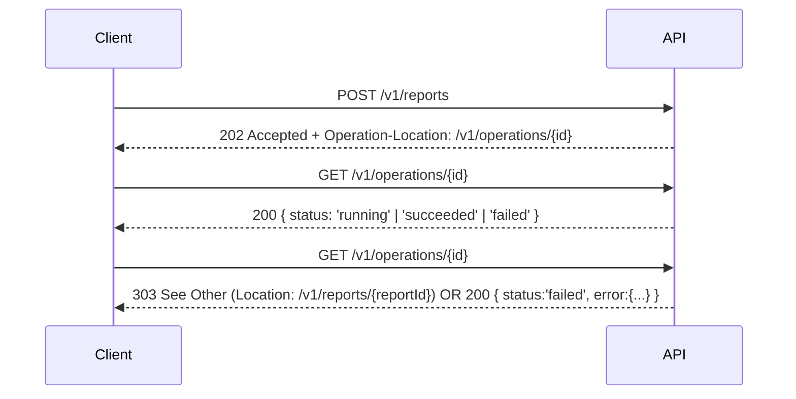

This isn't a "click here to sign up" tutorial. It's the **practical API design playbook** I wish every team started with: design-first using **OpenAPI 3.1**, model the hard edges early (errors, pagination, idempotency), and use **Stoplight** to author/spec-review and **Postman** to test/enforce the contract.

## Why design-first?

- **Cheaper changes**: it's easier to fix a schema than to unpick a shipped endpoint.
- **Parallel work**: product, back-end, and front-end can move together using mocks.
- **Living contract**: the spec is the source of truth for code, docs, and tests.

**Tooling roles**
- **Stoplight (or your preferred OpenAPI editor)**: author the spec, validate, mock, and publish docs.
- **Postman**: import the spec as a collection, write test assertions, run in CI to keep the implementation honest.

## OpenAPI foundation (3.1)

Start with **OpenAPI 3.1** (JSON Schema compliant). Keep the structure predictable:

```yaml
openapi: 3.1.0
info:
  title: Example API
  version: 1.0.0
servers:
  - url: https://api.example.com
components:
  securitySchemes:
    OAuth2:
      type: oauth2
      flows:
        clientCredentials:
          tokenUrl: https://auth.example.com/oauth/token
          scopes:
            read: Read access
            write: Write access
  parameters:
    CorrelationId:
      in: header
      name: X-Correlation-ID
      schema: { type: string, format: uuid }
      required: false
  responses:
    Error:
      description: Error envelope
      content:
        application/json:
          schema:
            $ref: '#/components/schemas/Error'
  schemas:
    Error:
      type: object
      required: [error]
      properties:
        error:
          type: object
          required: [code, message]
          properties:
            code: { type: string, example: 'validation_error' }
            message: { type: string }
            details:
              type: array
              items:
                type: object
                properties:
                  field: { type: string }
                  issue: { type: string }

paths:
  /v1/things:
    get:
      summary: List things (cursor pagination)
      parameters:
        - name: limit
          in: query
          schema: { type: integer, minimum: 1, maximum: 200, default: 50 }
        - name: cursor
          in: query
          schema: { type: string, nullable: true }
        - $ref: '#/components/parameters/CorrelationId'
      responses:
        '200':
          description: A page of things
          content:
            application/json:
              schema:
                type: object
                required: [data]
                properties:
                  data:
                    type: array
                    items:
                      $ref: '#/components/schemas/Thing'
                  next_cursor:
                    type: string
                    nullable: true
        '400': { $ref: '#/components/responses/Error' }
        '401': { $ref: '#/components/responses/Error' }
        '429': { $ref: '#/components/responses/Error' }
    post:
      summary: Create a thing (idempotent)
      security: [{ OAuth2: [write] }]
      parameters:
        - name: Idempotency-Key
          in: header
          required: true
          schema: { type: string, description: 'Client-generated unique key per create attempt' }
      requestBody:
        required: true
        content:
          application/json:
            schema: { $ref: '#/components/schemas/ThingCreate' }
      responses:
        '201':
          description: Created
          headers:
            Location:
              schema: { type: string, format: uri }
        '409': { $ref: '#/components/responses/Error' }
        '422': { $ref: '#/components/responses/Error' }
        '400': { $ref: '#/components/responses/Error' }
```

### Key ideas baked in
- **Error envelope**: one, consistent shape for all errors (code, message, optional details[]).
- **Correlation ID**: echo X-Correlation-ID in logs; include it in error responses.
- **Cursor pagination**: stable iteration, better than page=N for large datasets.
- **Idempotency**: Idempotency-Key header on creates to make retries safe.
- **Version in the path**: /v1/... (simple and explicit).

---

## Error taxonomy (make failures boring)

Keep errors predictable for clients:

```json
{
  "error": {
    "code": "validation_error",
    "message": "name is required",
    "details": [{ "field": "name", "issue": "required" }]
  }
}
```

### Suggested codes
- **validation_error** (400)
- **authentication_failed** (401)
- **authorization_failed** (403)
- **resource_not_found** (404)
- **conflict** (409)
- **rate_limited** (429)
- **internal_error** (500)

Return 409 for genuine conflicts (e.g., duplicate unique key), not for validation failures (422).

---

## Pagination that won't bite you later

Prefer cursor pagination:
- **Request**: GET /v1/things?limit=50&cursor={token}
- **Response**: include next_cursor (or null).

Cursors should be opaque (base64 data you can change server-side later). If you must support sorting/filters, treat them as part of the cursor calculation so pagination remains stable.

---

## Idempotency (safe retries)

Clients will retry. Make POST safe with an Idempotency-Key:
- Store (key, request hash) → response mapping for a window (e.g., 24h).
- If the same key arrives with the same request, replay the original response (201/200).
- If the same key arrives with a different request body, return 409 conflict.

This enables aggressive client-side retry without fear.

---

## Long-running work (async jobs)

For heavy operations, respond 202 Accepted and let the client poll a job resource (or use webhooks).



- **Use Operation-Location (or Location) to point at a status resource.**
- **When done, 303 See Other to the final resource, or return a terminal failure with the error envelope.**

If your consumers can accept callbacks, consider webhooks:

```mermaid
flowchart TD
  A[Client registers webhook] --> B[POST /v1/webhooks {url, secret}]
  B --> C[POST /v1/reports]
  C --> D[API completes job]
  D --> E[API POSTs event to webhook URL (HMAC signed)]
  E --> F[Client acknowledges 2xx]
```

Document retries, signing (HMAC), event schema, and backoff.

---

## Filtering, sorting, and sparse fields
- **Filters**: explicit query params (?status=active&created_after=2025-01-01).
- **Sorting**: ?sort=created_at or ?sort=-created_at (descending with -).
- **Sparse fields**: ?fields=thing:id,name,status to keep payloads small.

Write these into the spec so code and docs stay aligned.

---

## Versioning & deprecation
- **Major versions via the path**: /v1, /v2.
- **Within a major version, changes must be backwards compatible.**
- **Deprecate with Deprecation and Sunset headers and a Link: <url>; rel="deprecation" to the migration guide. Set clear dates.**

---

## Security: OAuth 2.0 (client credentials) + scopes

Model scopes in the spec and put them on operations:

```yaml
security:
  - OAuth2: [read]
```

Return 403 with a clear authorization_failed code if the token lacks scope.

Also model rate limits:
- **Response headers**: X-RateLimit-Limit, X-RateLimit-Remaining, Retry-After.
- **Exhausted? Return 429 with rate_limited.**

---

## Stoplight + Postman workflow (enforce the contract)

### In Stoplight
1. Author endpoints and schemas.
2. Validate with built-in rules (lint for naming, descriptions, examples).
3. Publish preview docs for review.
4. Use mock server to unblock front-end.

### In Postman
1. Import the OpenAPI spec → collection.
2. Add tests (assert status codes, schema matches, error shapes, headers like X-Correlation-ID).
3. Run in CI on every PR: if tests fail, the implementation doesn't match the spec.

Example Postman test (JSON schema + headers):

```javascript
pm.test("has correlation id", () => {
  pm.expect(pm.response.headers.has("X-Correlation-ID")).to.be.true;
});
pm.test("error envelope shape", () => {
  if (pm.response.code >= 400) {
    const body = pm.response.json();
    pm.expect(body).to.have.property("error");
    pm.expect(body.error).to.have.keys(["code","message"]);
  }
});
```

---

## Naming & consistency (the boring bits that matter)
- **Nouns for resources, verbs for actions** (/v1/users, not /v1/getUsers).
- **Plural collections, singular items** (/v1/things vs /v1/things/{id}).
- **snake_case in JSON, kebab-case in URLs, and PascalCase only in code** – pick a style and stick to it.
- **Keep timestamps UTC in RFC 3339.**

---

## Ship it: a small checklist
- Every path has summary, description, examples.
- Error envelope is consistent across all 4xx/5xx.
- Pagination is cursor-based for large lists.
- Idempotency on POST creates.
- Long-running operations are 202 + status resource (or webhooks).
- OAuth scopes and rate limits modeled.
- Postman tests run in CI against the spec.
- Deprecation and versioning policy documented.

---

Good APIs make success easy and failure predictable. Start with a spec you can test, model the "unhappy paths" early, and let Stoplight + Postman keep your implementation honest.