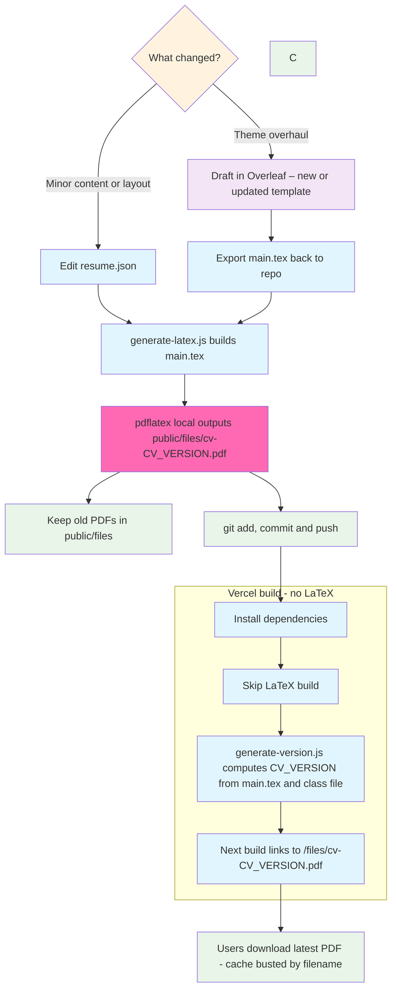

A web CV wants accessibility and SEO. A printable CV wants real typesetting: hyphenation, ligatures, predictable page breaks. I stopped forcing one file to do both.

- **Web**: a normal `/cv` page (React/MDX).
- **Print**: a **LaTeX** PDF built locally via `pdflatex`, then committed.

Vercel never touches LaTeX; it just gets a version number and a ready-made PDF.

## Architecture



- **Hashed artifacts kept**: old PDFs remain in /public/files (cv-<hash>.pdf history).
- **Linking**: the site imports CV_VERSION and links directly to /files/cv-${CV_VERSION}.pdf (no query param).
- **No LaTeX in CI**: Vercel skips TeX completely; the PDF is already in the repo.

## Source of truth & drafting
- **Day to day, content lives in resume.json**; generate-latex.js turns it into cv-source/main.tex with proper escaping and section stitching.
- **For small layout tweaks, I'll export cv-source/main.tex to Overleaf**, experiment, then pull the updated TeX back and keep generating from JSON.
- **For big theme changes, I start from a new Overleaf template**, paste in JSON content manually, then adjust the generator/JSON schema so future edits are back to "change JSON → regenerate."

## Build flow (local → commit → deploy)
- **Local**: npm run update-cv (or equivalent) which:
  1. regenerates main.tex from JSON,
  2. runs pdflatex to produce public/files/cv-<hash>.pdf,
  3. optionally cleans aux files.
- **Commit the PDF(s) and push.**
- **Vercel build runs generate-version.js** which hashes cv-source/main.tex (and the class file) and writes CV_VERSION to lib/version.js. The front end reads that constant.

```tsx
// /app/cv/page.tsx (excerpt)
import { CV_VERSION } from '@/lib/version';
const cvUrl = `/files/cv-${CV_VERSION}.pdf`;
// ...
<a href={cvUrl} target="_blank" rel="noopener noreferrer">Open PDF Version</a>
```

## Why this approach won
- **Print quality you can feel**: LaTeX handles line breaks, spacing, ligatures, and avoids orphan/widow lines. Your class file centralises the rules.
- **Deterministic builds**: pdflatex runs on your machine, so the PDF you proof is the PDF you ship.
- **Zero CI pain**: no TeX in Vercel; builds stay fast.
- **Instant cache correctness**: the filename carries the content hash; the link updates as soon as CV_VERSION changes.

## Notes from the trenches
- **Escaping**: generating TeX from JSON means escaping _ % & # everywhere. The generator handles this—extend it when adding new fields.
- **Don't edit TeX post-gen**: if you hand-tweak main.tex, your hash and data will drift. Fix the generator or JSON instead.
- **Template evolution**: it's fine to treat Overleaf as an R&D lab. For small tweaks, round-trip the single file; for big theme overhauls, adopt the new template, then bring the generator back into the loop.

## Future niceties (on the backlog)
- **Pre-push guard**: fail the push if cv-source changed but the committed PDF didn't.
- **One-shot "rebuild CV" action**: a local script that opens Overleaf export, drops it into cv-source, regenerates, builds, and stages everything.

## Related posts
- [Vibe Coding](/blog/vibe-coding) — how I iterate quickly on small, high-leverage changes.
- [Automating My GitHub Avatar Sync](/blog/github-image-sync) — same "one source of truth → pipeline handles the rest" pattern, applied to images.