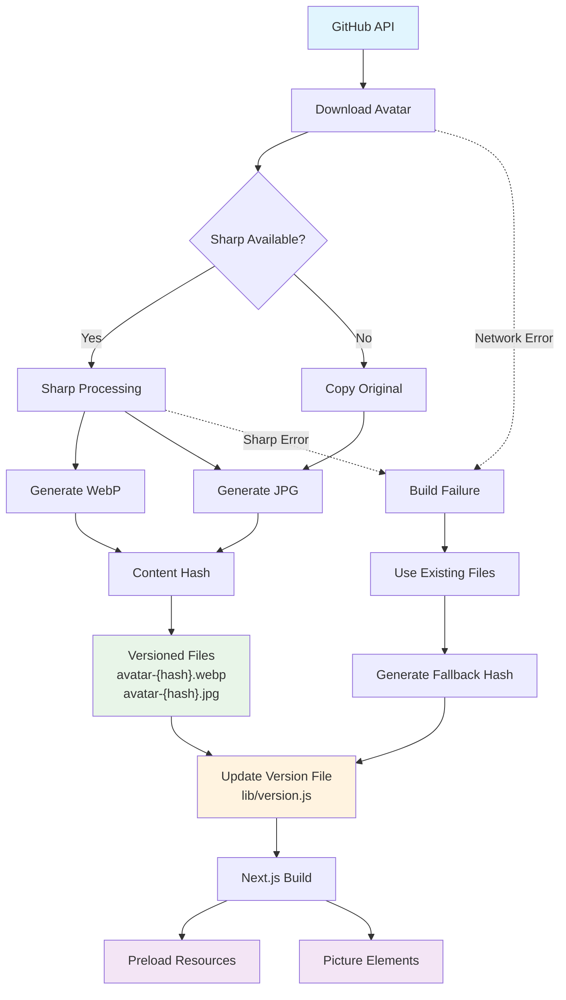

The slow part wasn’t updating my GitHub avatar — that’s quick thanks to GitHub’s built-in cropping. The real time-sink was **keeping my website avatar in sync**: converting to WebP, resizing for the circle mask, and pushing updates to the repo. I automated the whole thing by making **GitHub the source of truth** and letting my build pipeline do the rest.

## Architecture at a Glance



## How It Works
- **Source of truth**: I update my avatar through GitHub's UI (which already has a great circular crop).
- **Trigger**: A push to main kicks off a Vercel build.
- **Fetch**: A small Node.js script downloads the current GitHub avatar over HTTPS.
- **Optimise**: Another Node.js script uses Sharp to resize, convert to WebP, and strip excess metadata.
- **Cache-smart deploy**: The build computes a content hash. If the image bytes didn't change, the filename stays the same (cache hits). If it did change, the filename changes immediately (cache busts) so Cloudflare, Vercel, and browsers serve the new file right away.
- **Publish**: The optimised asset is written to the site's assets folder and deployed.

Credit: the content-hashing approach came from Claude Sonnet 3.7 and has been rock-solid.

## The Code: GitHub API Integration

Here's the core function that fetches the avatar from GitHub's API:

```javascript
async function fetchGitHubAvatar() {
  try {
    console.log(`📡 Fetching GitHub user data for: ${GITHUB_USERNAME}`);

    // Fetch user data from GitHub API
    const userData = await new Promise((resolve, reject) => {
      const options = {
        hostname: "api.github.com",
        path: `/users/${GITHUB_USERNAME}`,
        headers: {
          "User-Agent": "ainsworth.dev-avatar-fetcher",
        },
      };

      https
        .get(options, (res) => {
          if (res.statusCode !== 200) {
            reject(new Error(`GitHub API returned ${res.statusCode}`));
            return;
          }

          let data = "";
          res.on("data", (chunk) => (data += chunk));
          res.on("end", () => {
            try {
              resolve(JSON.parse(data));
            } catch (e) {
              reject(new Error("Invalid JSON response"));
            }
          });
        })
        .on("error", reject);
    });

    if (!userData.avatar_url) {
      throw new Error("No avatar_url in response");
    }

    const avatarUrl = `${userData.avatar_url}&s=${AVATAR_SIZE}`;
    console.log(`📥 Downloading from: ${avatarUrl}`);

    // Download to temp file
    await downloadImage(avatarUrl, TEMP_PATH);
    
    // ... rest of processing
  } catch (error) {
    console.log("ℹ️  Avatar fetch failed, using existing files");
    console.log(`   Reason: ${error.message}`);
  }
}
```

The key insight is using GitHub's public user API (`/users/{username}`) which doesn't require authentication and provides the current `avatar_url`. By appending `&s={size}` to the URL, we can request the exact dimensions we need.

For more details, see the [GitHub REST API documentation](https://docs.github.com/en/rest/users/users#get-a-user).

## Why Node, Not Bash?

This pipeline started life in shell scripts but quickly moved to Node for reliability and portability:
- **HTTP fetching with retries and proper error handling** is simpler in Node.
- **Sharp gives consistent, high-quality image processing** without external system deps.
- **Cross-platform behaviour** (local dev, CI, Vercel) is predictable.

## Lessons Learned
- **Designate a source of truth**. Don't crop/convert in two places — let GitHub's avatar UI handle that job.
- **Hash the bytes, not the idea**. Human "this looks the same" isn't good enough; content hashing makes cache behaviour deterministic.
- **Automate the boring parts**. Image chores (resize/convert) are perfect for scripts; use your human time on design and writing.

## Related Reading
- [AI Coding Tools: My Journey From Frustration to Flow](/blog/ai-coding-tools) — how I decide what work to hand to automation.
- [Seasonal Avatar Borders](/blog/seasonal-avatar-borders) — another small automation that keeps the site feeling alive.

## Closing Thoughts

The best developer ergonomics often come from removing the micro-chores you’ve normalised. By treating GitHub as the master copy and letting Vercel + Node handle the rest, my site stays fresh without me opening an image editor.
