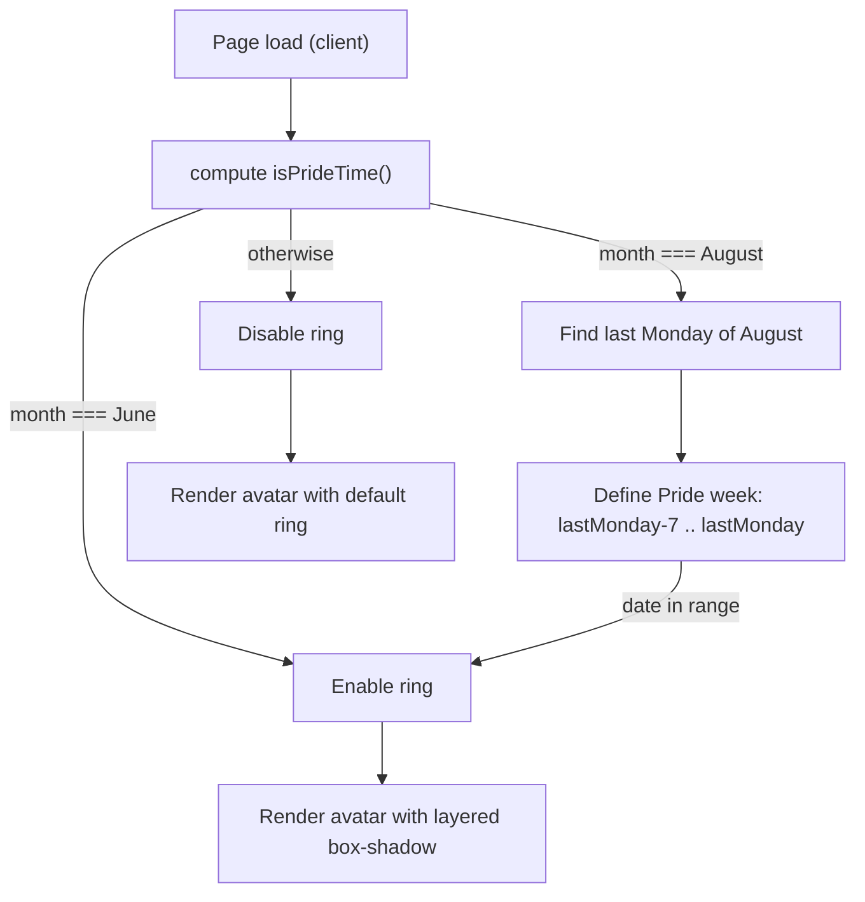

I wanted my site to feel alive without adding another manual chore. This component adds a **rainbow ring** to my avatar automatically during **Pride Month (June)** and **Manchester Pride week** — all **at runtime** in the browser based on client date/time.

## Architecture (Runtime, Not Build)



## Core Logic (TypeScript, client-side)

```tsx
"use client";

import { useEffect, useState } from "react";

export function PrideAvatar({ children, className = "" }: { children: React.ReactNode; className?: string; }) {
  const [isPrideTime, setIsPrideTime] = useState(false);

  useEffect(() => {
    const checkPrideTime = () => {
      const now = new Date();
      const month = now.getMonth() + 1; // 1..12
      const date = now.getDate();

      // Pride Month: entire June
      if (month === 6) return setIsPrideTime(true);

      // Manchester Pride: week running up to UK August bank holiday (last Monday)
      if (month === 8) {
        const year = now.getFullYear();
        const lastDay = new Date(year, 8, 0).getDate();   // 31
        const lastDow = new Date(year, 7, lastDay).getDay(); // 0=Sun..1=Mon..
        const lastMonday = lastDow === 1 ? lastDay : lastDay - ((lastDow + 6) % 7);
        const start = Math.max(1, lastMonday - 7);        // handle spill into July
        if (date >= start && date <= lastMonday) return setIsPrideTime(true);
      }

      setIsPrideTime(false);
    };

    checkPrideTime();
    const interval = setInterval(checkPrideTime, 24 * 60 * 60 * 1000); // daily
    return () => clearInterval(interval);
  }, []);

  if (!isPrideTime) return <div className={`ring-2 ring-black dark:ring-white rounded-full ${className}`}>{children}</div>;

  return (
    <div className={`relative ${className}`}>
      <div
        className="rounded-full"
        style={{ boxShadow: `
          0 0 0 3px rgb(239 68 68),   /* red   */
          0 0 0 6px rgb(249 115 22),  /* orange*/
          0 0 0 9px rgb(250 204 21),  /* yellow*/
          0 0 0 12px rgb(34 197 94),  /* green */
          0 0 0 15px rgb(59 130 246), /* blue  */
          0 0 0 18px rgb(147 51 234)  /* purple*/
        `}}
      >
        {children}
      </div>
    </div>
  );
}
```

## Why this approach works

- **Zero deployment coupling.** No build‑time flags or server toggles; the ring appears as soon as the calendar flips.
- **Lightweight.** Six hard‑edged `box-shadow` layers around a small avatar are cheap to paint on modern GPUs.
- **Predictable behaviour.** Manchester Pride is derived from the **UK August bank holiday**: the **last Monday of August**, with the ring enabled from the **previous Tuesday** through that Monday.

## Gotchas & Improvements

- **Timezone nuance.** It currently uses the **user’s local time**. If you want UK‑accurate behaviour worldwide, compute dates with `Europe/London` using `Intl.DateTimeFormat` or a small helper, then compare.
- **Midnight drift.** `setInterval(24h)` isn’t aligned to midnight and can drift. Optionally schedule the **next run at local midnight** via `setTimeout(nextMidnight - now)` and then re‑arm.
- **Testing/preview.** Add a query flag or env override to force a state for screenshots: e.g., `?pride=1` or `NEXT_PUBLIC_FORCE_PRIDE=true`.
- **Accessibility.** Provide a fallback ring (already in place), and ensure the avatar’s content remains distinguishable on both light/dark themes. If you animate the ring in future, guard with `@media (prefers-reduced-motion)`.

## Usage

```tsx
import Image from "next/image";
import { PrideAvatar } from "@/components/pride-avatar";

export default function ProfilePic() {
  return (
    <PrideAvatar className="w-24 h-24 overflow-hidden">
      <Image src="/me.webp" alt="Sam Ainsworth" width={96} height={96} />
    </PrideAvatar>
  );
}
```

## Related posts

- [Automating My GitHub Avatar Sync](/github-image-sync) — my avatar image is kept in sync with GitHub automatically.
- [AI Coding Tools: My Journey From Frustration to Flow](/ai-coding-tools) — how I decide what to automate and why.
