## The Idea

What if your profile avatar could celebrate important moments throughout the year? While most websites have static profile photos, I wanted mine to automatically show support during Pride Month and Manchester Pride week with rainbow borders.

Here's how I built a delightful seasonal avatar system that adds rainbow borders at just the right times.

## 🏳️‍🌈 The Feature in Action

Here's the feature working - the same avatar with different seasonal treatments:

[AVATAR_DEMO]

## 🗓️ Date Detection Logic

The system automatically detects two Pride periods:

### 1. Pride Month (June)
```typescript
const month = now.getMonth() + 1; // getMonth() is 0-indexed
if (month === 6) {
  setIsPrideTime(true);
  return;
}
```

Simple and straightforward - the entire month of June gets rainbow borders.

### 2. Manchester Pride Week
This is more complex since it's calculated relative to the August bank holiday:

```typescript
if (month === 8) {
  const year = now.getFullYear();
  
  // Find the last Monday of August (August bank holiday)
  const lastDayOfMonth = new Date(year, 8, 0).getDate();
  let lastMonday = lastDayOfMonth;
  const lastDayWeekday = new Date(year, 7, lastDayOfMonth).getDay();
  
  // Calculate the date of the last Monday
  if (lastDayWeekday === 1) {
    lastMonday = lastDayOfMonth;
  } else {
    lastMonday = lastDayOfMonth - ((lastDayWeekday + 6) % 7);
  }
  
  // Pride week: 7 days before through bank holiday Monday
  const prideWeekStart = lastMonday - 7;
  const prideWeekEnd = lastMonday;
  
  if (date >= prideWeekStart && date <= prideWeekEnd) {
    setIsPrideTime(true);
  }
}
```

This complex calculation ensures the rainbow appears during the actual Manchester Pride festival week, which varies each year.

## 🎨 CSS Box-Shadow Magic

The rainbow border uses CSS `box-shadow` to create concentric coloured rings:

```typescript
<div 
  className="rounded-full"
  style={{
    boxShadow: `
      0 0 0 3px rgb(239 68 68),   /* red-500 - outermost */
      0 0 0 6px rgb(249 115 22),  /* orange-500 */
      0 0 0 9px rgb(250 204 21),  /* yellow-400 */
      0 0 0 12px rgb(34 197 94),  /* green-500 */
      0 0 0 15px rgb(59 130 246), /* blue-500 */
      0 0 0 18px rgb(147 51 234)  /* purple-500 - innermost */
    `
  }}
>
  {children}
</div>
```

### Why Box-Shadow?

- **Smooth curves**: Follows the `border-radius` perfectly
- **Multiple colors**: Stack multiple shadows for rainbow effect
- **Performance**: Single CSS property, no additional DOM elements
- **Responsive**: Scales naturally with the avatar size

## 🔄 The Detection Flow

Here's how the system determines which border to show:

```mermaid
flowchart TD
    A[Page Load] --> B[Check Current Date]
    B --> C{Month == 6?}
    C -->|Yes| D["Pride Month!
    🏳️‍🌈 Rainbow Border"]
    C -->|No| E{Month == 8?}
    E -->|No| F[Normal Border]
    E -->|Yes| G[Calculate Bank Holiday]
    G --> H[Find Last Monday of August]
    H --> I[Pride Week = 7 Days Before]
    I --> J{"Current Date in
    Pride Week?"}
    J -->|Yes| D
    J -->|No| F
    
    style D fill:#ff69b4
    style F fill:#e1f5fe
```



## 🧩 Component Architecture

### PrideAvatar Wrapper
```typescript
interface PrideAvatarProps {
  children: React.ReactNode;
  className?: string;
}

export function PrideAvatar({ children, className = '' }: PrideAvatarProps) {
  const [isPrideTime, setIsPrideTime] = useState(false);

  useEffect(() => {
    const checkPrideTime = () => {
      // Date detection logic here
    };

    checkPrideTime();
    
    // Check daily at midnight
    const interval = setInterval(checkPrideTime, 24 * 60 * 60 * 1000);
    
    return () => clearInterval(interval);
  }, []);

  // Render logic
}
```

### Normal vs Pride Rendering
```typescript
if (!isPrideTime) {
  return (
    <div className={`ring-2 ring-black dark:ring-white rounded-full ${className}`}>
      {children}
    </div>
  );
}

// Rainbow border rendering...
```

## ⚡ Performance Considerations

### Client-Side Only
The component uses `'use client'` directive because:
- Date calculations need to run in the browser
- Server-side rendering would show inconsistent states
- The `useEffect` hook manages the interval properly

### Efficient Updates
```typescript
// Check daily at midnight instead of constantly
const interval = setInterval(checkPrideTime, 24 * 60 * 60 * 1000);
```

### Minimal Re-renders
The `useState` only updates when Pride time actually changes, not on every render.

## 🌍 Localization Considerations

The current implementation uses:
- **UTC dates** for consistency
- **UK bank holidays** for Manchester Pride
- **Hardcoded June** for international Pride Month

For international support, you could extend this with:
- Multiple regional Pride dates
- User location detection
- Configurable Pride periods

## 🎯 Real-World Impact

This small feature has several benefits:

### User Engagement
- **Delightful surprise** when users notice the change
- **Shows values** and inclusivity
- **Seasonal variety** keeps the site feeling fresh

### Technical Learning
- **Date calculations** in JavaScript
- **CSS advanced techniques** with box-shadow
- **React hooks** for side effects and timers

### SEO and Accessibility
- **No impact on performance** - pure visual enhancement
- **Maintains alt text** and screen reader compatibility
- **Graceful degradation** if JavaScript disabled

## 🚀 Extension Ideas

The seasonal border system could be extended for:

### Additional Celebrations
- **Black History Month** (February)
- **International Women's Day** (March 8)
- **Earth Day** (April 22)
- **Mental Health Awareness Week**

### Dynamic Borders
- **Country flags** for national holidays
- **Seasonal colours** for equinoxes and solstices
- **Personal milestones** like anniversaries

### Interactive Features
- **Click to learn more** about the current celebration
- **Social sharing** of the special avatar
- **User preferences** to enable/disable seasonal features

## 💡 Implementation Tips

### Testing Seasonal Logic
```typescript
// Override date for testing
const testDate = new Date('2024-06-15'); // Force Pride Month
const month = testDate.getMonth() + 1;
```

### Colour Accessibility
Ensure rainbow colours have sufficient contrast:
```typescript
// Use Tailwind's colour palette for consistency
const colors = [
  'rgb(239 68 68)',   // red-500
  'rgb(249 115 22)',  // orange-500
  'rgb(250 204 21)',  // yellow-400 (lighter for visibility)
  'rgb(34 197 94)',   // green-500
  'rgb(59 130 246)',  // blue-500
  'rgb(147 51 234)'   // purple-500
];
```

### Performance Monitoring
```typescript
// Optional: Track when Pride borders are shown
useEffect(() => {
  if (isPrideTime) {
    analytics.track('pride_border_shown', {
      period: month === 6 ? 'pride_month' : 'manchester_pride'
    });
  }
}, [isPrideTime]);
```

## 🎉 Conclusion

This seasonal avatar border system demonstrates how small, thoughtful features can add significant user delight. The combination of:

- **Precise date calculations**
- **Beautiful CSS effects** 
- **Performant React patterns**
- **Inclusive design values**

Creates a feature that's both technically interesting and socially meaningful.

The rainbow borders appear automatically at just the right times, surprising and delighting users while showing support for the LGBTQ+ community. Sometimes the best features are the ones users don't expect but love when they discover them.

---

*The avatar borders you see throughout this site are powered by this system - if you're reading during Pride Month or Manchester Pride week, you're seeing the rainbow magic in action! 🏳️‍🌈*