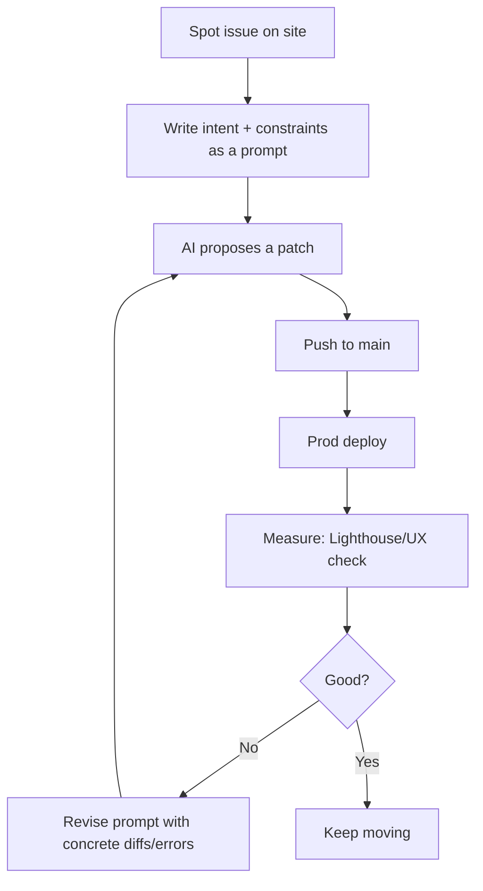

# Vibe Coding: Shipping Faster Without Shipping Garbage

This wasn't a sprint or a grand plan. I browsed my site like a visitor, found rough spots (CV out of date, blog light on content, slow pages, Lighthouse a11y warnings, weak SEO), and polished them one by one. Think **detailing a car**: fix a scuff, step back, spot the next one.

The twist: I used an AI assistant to handle the **gruntwork**, while I kept ownership of **intent and review**.

## What actually moved the needle

### 1) Images — the highest ROI
- Converted PNG/JPEG assets to **WebP**, added `<picture>` fallbacks.
- Set explicit **width/height** to kill layout shift; `loading="lazy"` and `decoding="async"` where safe.
- Right-sized oversized art and logos; kept photos less aggressively compressed to protect quality.
- Result: drastically smaller payloads and snappier LCP — with almost no creative risk.

```tsx
// Example shape used across components
export function BrandLogo() {
  return (
    <picture>
      <source srcSet="/images/logo.webp" type="image/webp" />
      
    </picture>
  );
}
```

### 2) Loading & CSS
- Removed render-blocking CSS; inlined only critical styles and deferred the rest.
- Tightened preconnect/preload hints to match real assets.
- Swapped "transition-all" for targeted transitions to reduce forced reflows.

### 3) Content & pipeline hygiene
- Hardened the MDX/blog pipeline so content renders the same locally and in prod.
- Kept CV page and CV PDF in lockstep (a small build step prevents drift).
- Added lightweight checks so broken links/image paths don't slip through.

### 4) Accessibility & SEO
- Wrote meaningful alt text and clarified semantics.
- Cleaned up titles/descriptions/canonicals; avoided duplicated headings.
- Small changes, but Lighthouse and search previews improved fast.

## Hardest problem: Mermaid visuals

Front-end visuals were where AI struggled most — especially Mermaid styling, sizing, and theme. What worked:
- Treat diagrams as responsive components (container-width, not fixed px).
- Use Mermaid's built-in theming for dark mode instead of ad-hoc CSS.
- Ensure fonts load predictably so label sizes don't jump between devices.
- Avoid position: absolute hacks; give diagrams a real layout context.

```tsx
// components/Mermaid.tsx
'use client';
import { useEffect } from 'react';
import mermaid from 'mermaid';

export default function Mermaid({ chart }: { chart: string }) {
  useEffect(() => {
    mermaid.initialize({
      startOnLoad: true,
      theme: 'default',
      securityLevel: 'loose',
      fontFamily: 'ui-sans-serif, system-ui',
    });
  }, []);
  return <div className="mermaid max-w-full overflow-auto">{chart}</div>;
}
```

## My real loop (because it's a personal site)

I ran an extreme programming cycle that I would not use in enterprise apps: prompt → push to main → test in prod. It kept momentum high and the feedback real (because prod is the only truth that matters for a personal site).



If I were doing this at work, I'd use a safer loop (local run, tests, preview deployments) — but for a personal site, this speed was fun and productive.

## Guardrails that actually helped
- Unit tests as "intent beacons". I add or update tests around the area I'm changing, so the AI has a target and I have a safety net.
- Do-not-touch zones. Config/secrets/infra are off-limits unless I explicitly say otherwise.
- Small diffs with measurable outcomes. If I can't write a one-line "why" in the commit, it's probably too big.

```tsx
// Example: make CLS improvements explicit
import { render } from '@testing-library/react';
import Home from '@/app/page';

it('renders hero image with fixed dimensions to avoid layout shift', () => {
  const { getByAltText } = render(<Home />);
  const img = getByAltText(/hero/i) as HTMLImageElement;
  expect(img.width).toBeGreaterThan(0);
  expect(img.height).toBeGreaterThan(0);
  expect(img.getAttribute('loading')).toBe('lazy');
});
```

## One big "aha"

If you're stuck in a prompt loop, it's almost always one of two things:
1. **Context**. You haven't given enough specific code, constraints, or failure output.
2. **Model**. You gave everything you can; it's time to switch tools (e.g., try a different model).

Swapping the model broke several deadlocks for me. When context is maxed out, try a different brain.

## Related posts
- [Automating My GitHub Avatar Sync](/blog/github-image-sync) — small automation, big ROI.
- [Seasonal Avatar Borders](/blog/seasonal-avatar-borders) — runtime flair via simple date logic.
- [AI Coding Tools: My Journey From Frustration to Flow](/blog/ai-coding-tools) — what I hand to automation and why.